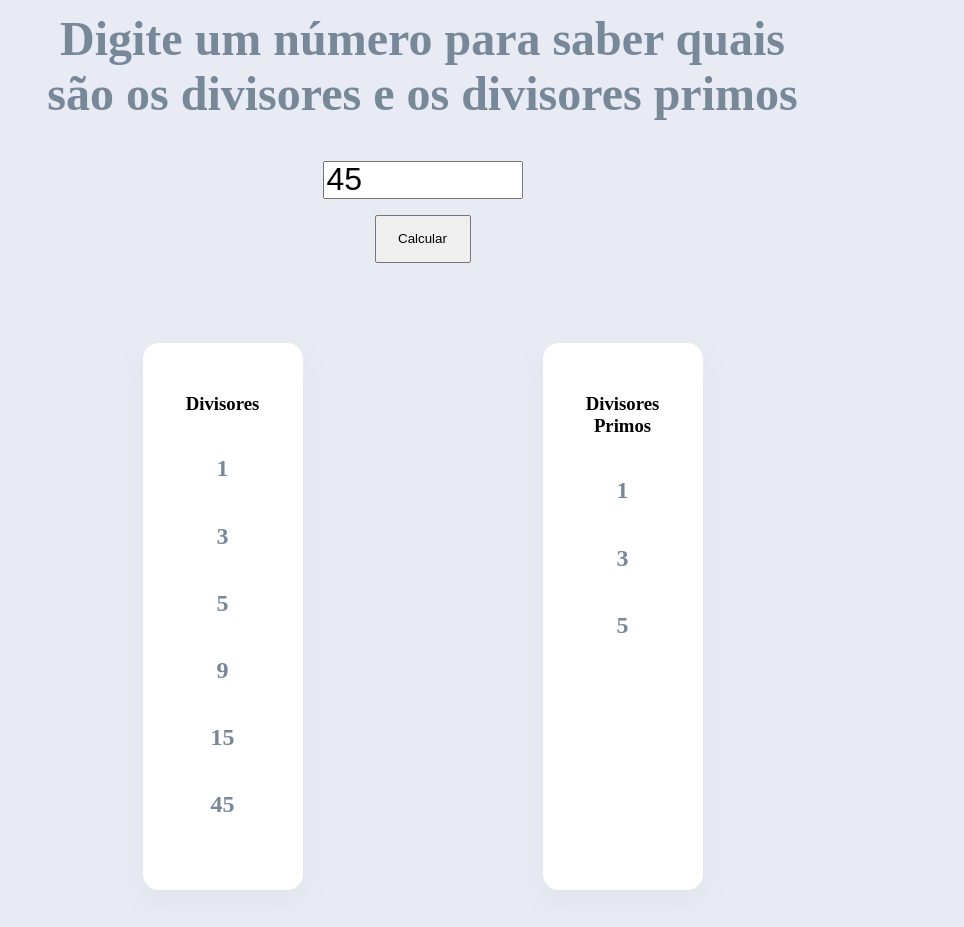

# DIVISORES FRONT

## Introdução

Esse projeto é a resolução de um desafio da Framework.
Consiste na parte equivalente ao front-end do projeto.

## Tecnologias

Confome desenvolvemos o projeto, atualizar quais tecnologias estamos utilizando

* [NodeJS](https://nodejs.org/en/):  É uma engine JavaScript.
* [Angular](https://angular.io/): É uma plataforma de aplicações web de código-fonte aberto e front-end baseado em TypeScript.

## Requisitos

* Ter instalado o NodeJS na versão mínima 17;
* Angular CLI;
* Git.

## Execução
Para executar o projeto é necessário executar os seguintes comandos:

* `npm install`;
* `npm run start` (Caso rode ng serve, algumas flags necessárias não serão executadas).

## Telas
 

### Tela principal

 

### Tela de erro de input

 

### Tela de erro de server ou client

 
